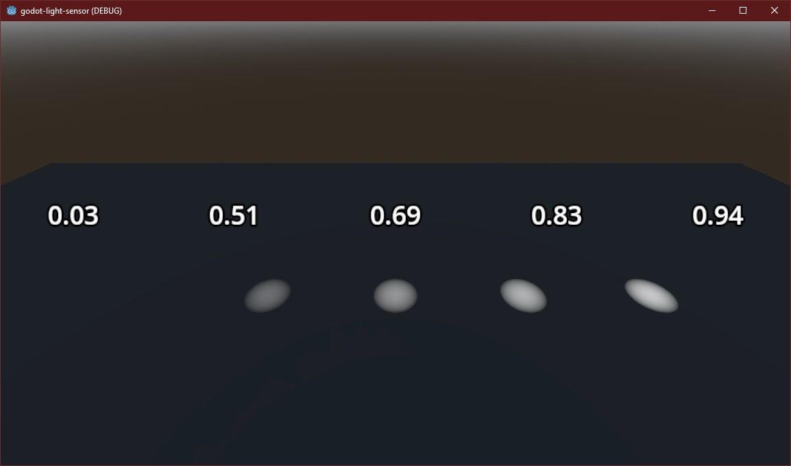

# Godot Light Sensor 3D

Do you need to find the total amount of light reaching a point in your Godot 4 3D project? Then you've come to the right place.

This asset contains a "light sensor" -- a tiny camera pointing at a tiny white plane that can be queried to determine how much light is reaching that plane. You can check the color, too, if you care about that.

## How to Use

1. Create a new node of type LightSensor3D.
2. Move it to the point you want to measure light.
3. Configure the layer.
4. Call the refresh() method on it periodically, e.g. every second.
5. Query it using the available properties, functions, and signals.

### Positioning and Orientation

The sensor is not a single point in space, capable of reading detecting light in a sphere. It's a plane, which means a couple things:
1. You'll _probably_ want to place the sensor low to the ground of your game.
2. You'll _probably_ want to orient the sensor so the sensor is pointing downwards (this is the default).

These suggestions are assuming you're measuring the amount of light some point on the ground is receiving.

### Configuring the Layer

The internal sensor mesh uses the layer you configure on the light sensor itself. You'll want to choose layer(s) based on the following principles:
1. The layer shouldn't be visible to your main camera, otherwise you'll see a small white plane near the center of the sensor.
2. The layer _should_ be visible to the lights you want to register on the light sensor, otherwise you won't get the desired readings.

### Calling the `refresh()` Method

Refreshing the sensor's state is pretty expensive, since it requires downloading data from the GPU back to the CPU (see [Texture2D#get_image](https://docs.godotengine.org/en/stable/classes/class_texture2d.html#class-texture2d-method-get-image)). In my tests, it takes on the order of 0.2ms, which is potentially a big chunk of the frame budget if you have multiple sensors updating every frame. Therefore, it's recommended to only update as often as you need -- once every 250ms or even less often.

Calling `refresh()` is left up to you. The easiest way to do this is to add a child node of the LightSensor3D of type [Timer](https://docs.godotengine.org/en/stable/classes/class_timer.html) that:
* has a wait time of 1 second, or whatever your update frequency need is.
* does **not** have one-shot enabled.
* does have autostart enabled.
* and lastly and most importantly, triggers the parent node's `refresh()` method in the `timeout` signal.

There's an included example scene that does this that you can also check out.

### Outputs

|          | name                | type                                                                     | description                                                                                            |   |   |
|----------|---------------------|--------------------------------------------------------------------------|--------------------------------------------------------------------------------------------------------|---|---|
| property | `color`             | [Color](https://docs.godotengine.org/en/stable/classes/class_color.html) | This is the current color the sensor is seeing.                                                        |   |   |
| property | `light_level`       | float                                                                    | This is the [luminance](https://en.wikipedia.org/wiki/Luminance) seen by the sensor. 0=dark, 1=bright. |   |   |
| signal   | color_updated       | (color: Color)                                                           | Emitted when the current color changes.                                                                |   |   |
| signal   | light_level_updated | (luminance: float)                                                       | Emitted when the light level changes.                                                                  |
Note that all of these require you to call `refresh()` before they'll be updated and triggered.